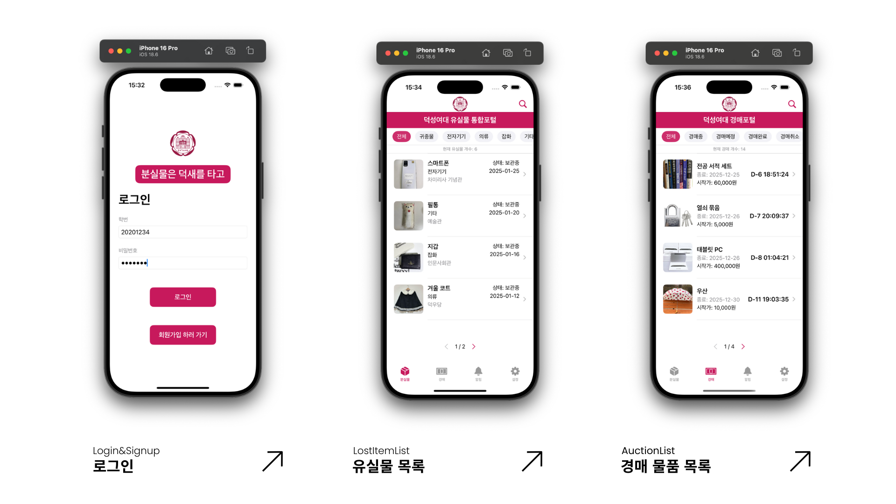
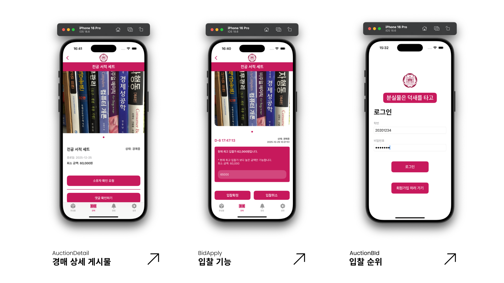
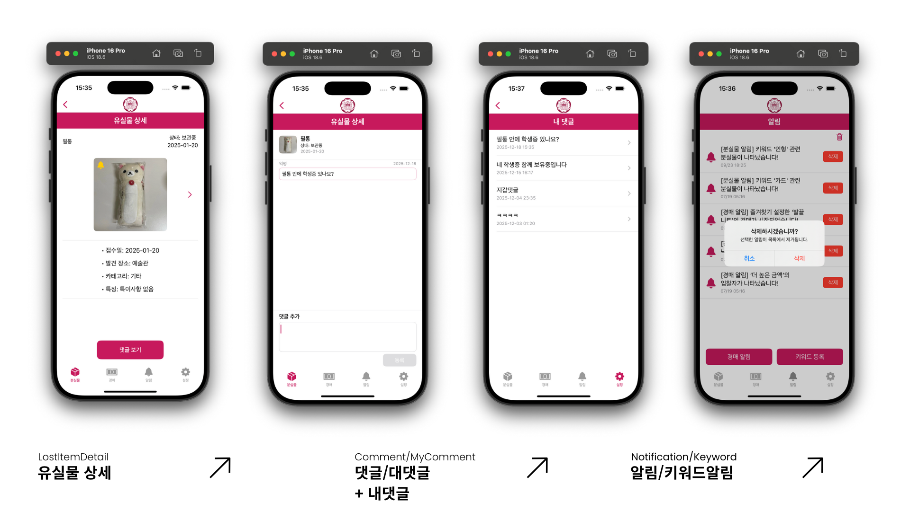

# 🎓 DS-Lostitem | 덕성여대 유실물 및 경매 통합포털

> 캠퍼스 분실물 관리 문제를 해결하는 유실물 게시판 + 경매 통합 iOS 애플리케이션입니다.

<br>

## 💻 기획 배경
캠퍼스에서 빈번히 발생하는 분실물 관리 문제를 해결하기 위해,  
**유실물 게시판**과 **경매 기능**을 하나의 앱으로 통합했습니다.

유실물로 등록된 물품이 **1년 내 미회수 시 경매 포털로 자동 전환**되어  
학생 간 입찰이 가능하도록 기획되었습니다.

- **팀명** : lambeen
- **개발 기간** : 2025.09 ~ 2025.12
- **배포** : 내부 테스트 / 시연용

<br>

## 🎯 개발 목적

- 학내 분실물 정보를 모바일에서 더 쉽고 빠르게 확인할 수 있도록 개발하였습니다.
- 분실물 보관 및 확인 절차를 보다 직관적으로 제공하고자 하였습니다.
- 일정 기간이 지난 물품을 경매 형태로 전환하여 물품 활용도를 높이고자 하였습니다.
- 기존의 단편적인 분실물 관리 방식을 개선하여 학내 분실물 관리의 효율성과 접근성을 높이고자 하였습니다.

<br>

## 👥 팀원

| 이름 | 역할 | 담당 업무 |
|------|------|-----------|
| <a href="https://github.com/chubin925">@츄빈 | 기획 / 개발 | 서비스 기획 및 화면 설계, iOS 앱 개발, 백엔드 연동 |
| <a href="https://github.com/B1ns">@정빈 | 디자인 / 프론트엔드 | UI 디자인, 일부 화면 구현 |

<br>

## 🛠 기술 스택

**iOS**


**Backend**


**Design**


<br>

## ✨ 주요 기능

| 기능 | 설명 |
|------|------|
| 🧾 분실물 조회 | 카테고리/조건 필터, 이미지·장소·날짜·상태 확인 |
| 🔍 분실물 상세 | 상세 정보 및 이미지 슬라이드, 댓글 문의 |
| ⚖️ 경매 조회 | 진행 중 물품 목록, 입찰가·종료 시간 확인 |
| 💰 경매 입찰 | 금액 입력 후 입찰 참여, 최고가 미달 시 차단 |
| 💬 댓글 관리 | 댓글/대댓글 작성, 내 댓글 모아보기 |
| 👤 마이페이지 | 활동 내역, 관심 물품 관리 |

<br>

## 📱 실행 화면





<br>

## 🔧 트러블슈팅

**경매 타이머 / 입찰 데이터 실시간 처리**
- 원인 : 단순 고정값 표시로는 UX 불일치 발생
- 해결 : 서버에서 종료 시각 기준으로 화면 갱신, 입찰 최고가 검증을 서버와 연동해 데이터 일관성 확보

<br>


## 📐 아키텍처
```
Client (SwiftUI)
    ↓ URLSession + JSON DTO
PHP API Server
    ↓ Query
MySQL DB
├── items (유실물 게시글)
├── photos (이미지, items 종속)
└── comments (댓글/대댓글, parent_id 자기참조)
```
